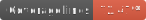
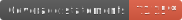

   

## Prerequisites
Before we start make sure you have: 
- **Telegram API token** - [example tutorial](https://github.com/hosein2398/node-telegram-bot-api-tutorial#creating-new-bot-with-botfather) 
- **Mongo DB configured** - [free db here](https://www.mongodb.com/atlas/database)
- **AWS Account** 

- **Node v14+**

## Setup
- **Install AWS CLI**
  - Mac: `brew install awscli`
- **Install Serverless**
  - `npm install serverless -g`
- **Install other dependencies** 
  - `npm install`
- **Setup environment variables**
  - Copy `.env.development.example` → `.env.development`
  - Enter real values

## Run
There are few ways to run the app: 
- **Invoke function directly** (handy for debugging)
  - `npm run invoke:local`
- **Start serverless locally** (offline)
  - `sls offline`

Keep in mind Serverless is fully dependent on AWS, and since it won't work locally 100% like in deployed environment 
it is a good idea to deploy and tests on AWS early on. 

## Deploy
Make sure you have AWS CLI configured and logged in, and then run:
- `sls deploy`
 
Alternatively use helper tools like [aws-vault](https://github.com/99designs/aws-vault):
  - `aws-vault exec -n your-vault-profile -- sls deploy`

## Testing
- **Run tests**
  - `npm run test:ci`
- **Run tests with coverage report**
  - `npm run test:coverage`
- **Generate coverage badges 😎**
  - `npm run test:badges`
